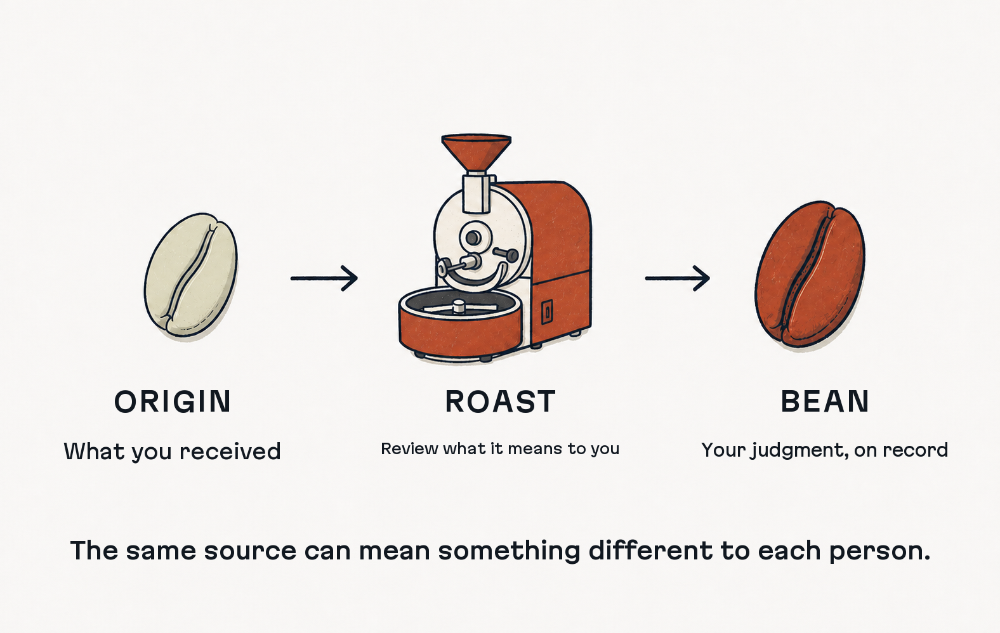
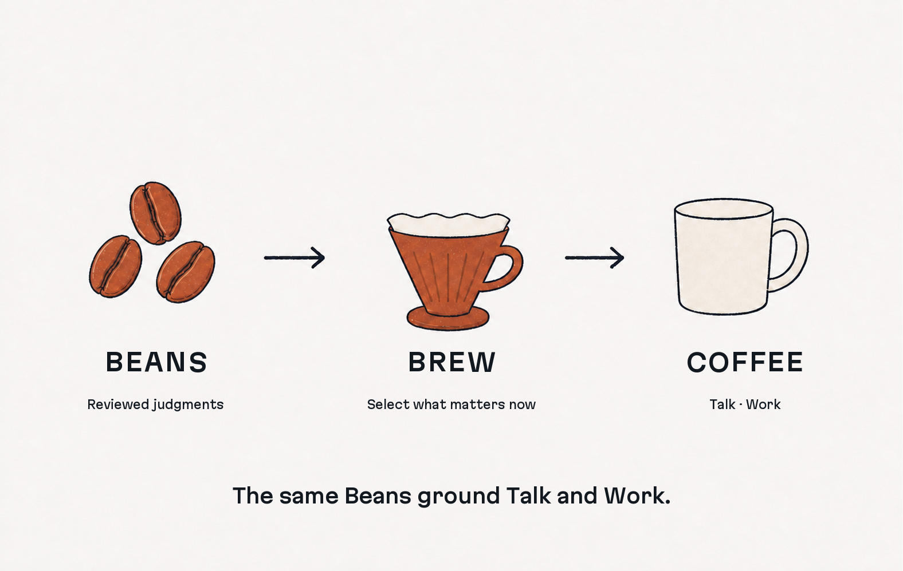

> [!IMPORTANT] **WIP** — Coffee Chat is under active development. This README
> shows the complete first release. Only `$coffee-init` is implemented today;
> the rest of the first-release Skills are not yet available.


Coffee Chat is an **Agent Plugin** that turns your reviewed judgments into
records people can explore through **Talk** and Agents can use in **Work**.

## The same information can lead two people in different directions.

Give two people the same news, paper, or plan. One may see an opportunity; the
other may see a risk.

Neither has to be pretending. Each acts on what seems important and right from
where they stand.

> **Same information. Different meaning. Different priority. Different next
> move.**

The source alone cannot tell an Agent which direction you would take. Coffee
Chat records that missing layer:

> **What it meant to you → What mattered to you → What you would do**

You review and own each record. People can explore it through **Talk**. Agents
can use it in **Work**.

> **As Agents make execution cheaper, deciding what matters becomes the
> bottleneck.**

## Install with your Agent

Paste this into your Agent:

```text
Install Coffee Chat. Follow this guide:
https://raw.githubusercontent.com/openboa-ai/coffee-chat/main/INSTALL_FOR_AGENTS.md
```

## Discover current capabilities

The package publishes one read-only, machine-readable
[capability contract](config/capabilities.json). It identifies the seven shipped
Skills, their contained entrypoints, and their current availability under the
same Coffee Chat CalVer as both Plugin manifests.

Reading this contract does not activate or execute a Skill. In this release,
only Init is available; the other six first-release Skills remain explicitly
`not_implemented`.

## Store judgment, not just information.

A **Bean** stores your approved judgment—not a copy of what you read.

**Origin** keeps the source visible. **Roast** records what it meant, what
mattered, and what you would do. What you approve becomes a **Bean**.



Across Beans, recurring priorities reveal your **Taste**.

## Use it in Talk and Work.

The same reviewed Beans help people understand your thinking and Agents work
from your priorities.

| **Talk**                          | **Work**                                                 |
| --------------------------------- | -------------------------------------------------------- |
| Understand what mattered and why. | Give Agents your priorities as they evaluate and create. |



## You stay in control.

Nothing becomes public without your approval.

- Origins stay separate from your judgment.
- Your Roastery stays versioned and under your control.
- Other people's Roasteries stay read-only.
- AI cites the Beans it uses. It never speaks as you, becomes a Bean, or
  replaces your final decision.

## Go deeper.

- [Product and release boundaries](docs/product-boundaries.md)
- [Roastery contract, storage, and rights](contract/roastery/README.md)
- [Quality map](docs/quality-map.md)
- [Security policy](SECURITY.md)

## License

Coffee Chat is [MIT licensed](LICENSE), Copyright © 2026 Openboa AI. Bean
content uses its owner's accepted CC BY 4.0 declaration; Origins remain outside
that grant.
